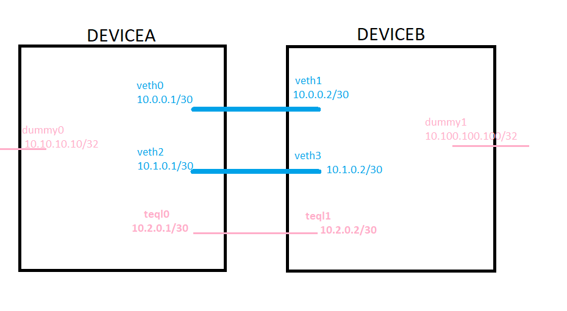

# linux-ecmp-lb-netns

A lab setup that tries to do equal cost multipath routing over two "physical" interfaces in order to gain double the bandwidth. The "physical" interfaces are simulated by using network namespaces and veth pairs.

# Lab diagram



# Base network setup

* create interface pairs
```
ip link add veth0 type veth peer name veth1
ip link add veth2 type veth peer name veth3
```

* add interfaces to the 'devicea' netns and add ip addresses, bring them up
```
ip netns add devicea
ip link set veth0 netns devicea
ip link set veth2 netns devicea

ip -n devicea addr add 10.0.0.1/30 dev veth0
ip -n devicea addr add 10.1.0.1/30 dev veth2

ip -n devicea link set veth0 up
ip -n devicea link set veth2 up

ip -n devicea link set lo up
```
Post configuration, it should look like this:
```
root@stingray:~# ip netns exec devicea ip addr show
1: lo: <LOOPBACK,UP,LOWER_UP> mtu 65536 qdisc noqueue state UNKNOWN group default qlen 1000
    link/loopback 00:00:00:00:00:00 brd 00:00:00:00:00:00
    inet 127.0.0.1/8 scope host lo
       valid_lft forever preferred_lft forever
    inet6 ::1/128 scope host 
       valid_lft forever preferred_lft forever
7: veth0@if6: <NO-CARRIER,BROADCAST,MULTICAST,UP> mtu 1500 qdisc noqueue state LOWERLAYERDOWN group default qlen 1000
    link/ether 06:64:fd:71:2d:36 brd ff:ff:ff:ff:ff:ff link-netnsid 0
    inet 10.0.0.1/30 scope global veth0
       valid_lft forever preferred_lft forever
9: veth2@if8: <NO-CARRIER,BROADCAST,MULTICAST,UP> mtu 1500 qdisc noqueue state LOWERLAYERDOWN group default qlen 1000
    link/ether 4e:f2:44:2f:95:9c brd ff:ff:ff:ff:ff:ff link-netnsid 0
    inet 10.1.0.1/30 scope global veth2
       valid_lft forever preferred_lft forever
```

* do the same thing for deviceb
```
ip netns add deviceb
ip link set veth1 netns deviceb
ip link set veth3 netns deviceb

ip -n deviceb addr add 10.0.0.2/30 dev veth1
ip -n deviceb addr add 10.1.0.2/30 dev veth3

ip -n deviceb link set veth1 up
ip -n deviceb link set veth3 up

ip -n deviceb link set lo up
```
You should now be able to ping "deviceb" from "devicea" via the directly connected links:
```
root@stingray:~# ip netns exec devicea ping -c 3 10.0.0.2
PING 10.0.0.2 (10.0.0.2) 56(84) bytes of data.
64 bytes from 10.0.0.2: icmp_seq=1 ttl=64 time=0.091 ms
64 bytes from 10.0.0.2: icmp_seq=2 ttl=64 time=0.063 ms
64 bytes from 10.0.0.2: icmp_seq=3 ttl=64 time=0.065 ms

--- 10.0.0.2 ping statistics ---
3 packets transmitted, 3 received, 0% packet loss, time 2031ms
rtt min/avg/max/mdev = 0.063/0.073/0.091/0.012 ms
root@stingray:~# ip netns exec devicea ping -c 3 10.1.0.2
PING 10.1.0.2 (10.1.0.2) 56(84) bytes of data.
64 bytes from 10.1.0.2: icmp_seq=1 ttl=64 time=0.081 ms
64 bytes from 10.1.0.2: icmp_seq=2 ttl=64 time=0.062 ms
64 bytes from 10.1.0.2: icmp_seq=3 ttl=64 time=0.063 ms

--- 10.1.0.2 ping statistics ---
3 packets transmitted, 3 received, 0% packet loss, time 2030ms
rtt min/avg/max/mdev = 0.062/0.068/0.081/0.008 ms
```

* set up dummy interfaces in each namespace to act as a source/destination

```
ip link add dummy0 type dummy
ip link set dummy0 netns devicea
ip -n devicea addr add 10.10.10.10/32 dev dummy0
ip -n devicea link set dummy0 up

ip link add dummy1 type dummy
ip link set dummy1 netns deviceb
ip -n deviceb addr add 10.100.100.100/32 dev dummy1
ip -n deviceb link set dummy1 up
```


# Shaping via wondershaper
We want to limit the veth interfaces to 5Mbps upload/download so that we can easily measure if we get the bandwidth sum when we do ECMP:
```
git clone https://github.com/magnific0/wondershaper.git
cd wondershaper
make install

ip netns exec devicea ip link add ifb0 type ifb
ip netns exec devicea ip link set dev ifb0 up
ip netns exec devicea wondershaper -a veth0 -u 5120 -d 5120
ip netns exec devicea wondershaper -a veth2 -u 5120 -d 5120

ip netns exec deviceb ip link add ifb0 type ifb
ip netns exec deviceb ip link set dev ifb0 up
ip netns exec deviceb wondershaper -a veth1 -u 5120 -d 5120
ip netns exec deviceb wondershaper -a veth3 -u 5120 -d 5120
```

* Test shaping by running iperf3 on a single veth pair
```
ip netns exec deviceb iperf3 -s
ip netns exec devicea iperf3 -c 10.0.0.2 -t 10
```
Output should look like:
```
root@stingray:~# ip netns exec devicea iperf3 -c 10.0.0.2 -t 10
Connecting to host 10.0.0.2, port 5201
[  5] local 10.0.0.1 port 41406 connected to 10.0.0.2 port 5201
[ ID] Interval           Transfer     Bitrate         Retr  Cwnd
[  5]   0.00-1.00   sec  1.01 MBytes  8.47 Mbits/sec    0   90.5 KBytes       
[  5]   1.00-2.00   sec   573 KBytes  4.69 Mbits/sec    0   90.5 KBytes       
[  5]   2.00-3.00   sec   573 KBytes  4.69 Mbits/sec    0   90.5 KBytes       
[  5]   3.00-4.00   sec   573 KBytes  4.69 Mbits/sec    0   90.5 KBytes       
[  5]   4.00-5.00   sec   573 KBytes  4.69 Mbits/sec    0   90.5 KBytes       
[  5]   5.00-6.00   sec   573 KBytes  4.69 Mbits/sec    0   90.5 KBytes       
[  5]   6.00-7.00   sec   573 KBytes  4.69 Mbits/sec    0   90.5 KBytes       
[  5]   7.00-8.00   sec   573 KBytes  4.69 Mbits/sec    0   90.5 KBytes       
[  5]   8.00-9.00   sec   573 KBytes  4.69 Mbits/sec    0   90.5 KBytes       
[  5]   9.00-10.00  sec   573 KBytes  4.69 Mbits/sec    0   90.5 KBytes       
- - - - - - - - - - - - - - - - - - - - - - - - -
[ ID] Interval           Transfer     Bitrate         Retr
[  5]   0.00-10.00  sec  6.04 MBytes  5.07 Mbits/sec    0             sender
[  5]   0.00-10.01  sec  5.55 MBytes  4.65 Mbits/sec                  receiver

iperf Done.

```


# Add ECMP routes for devicea to deviceb and viceversa using both links as nexthop

```
ip netns exec devicea ip route add 10.100.100.100/32 proto static scope global \
    nexthop dev veth0 via 10.0.0.2 weight 1 \
    nexthop dev veth2 via 10.1.0.2 weight 1

ip netns exec deviceb ip route add 10.10.10.10/32 proto static scope global \
    nexthop dev veth1 via 10.0.0.1 weight 1 \
    nexthop dev veth3 via 10.1.0.1 weight 1
```
The routing table should look like this:
```
root@stingray:~# ip netns exec devicea ip route show
10.0.0.0/30 dev veth0 proto kernel scope link src 10.0.0.1 
10.1.0.0/30 dev veth2 proto kernel scope link src 10.1.0.1 
10.100.100.100 proto static 
	nexthop via 10.0.0.2 dev veth0 weight 1 
	nexthop via 10.1.0.2 dev veth2 weight 1 
```

Let's run the iperf test and enjoy double bandwidth. We'll need to bind iperf3 to dummy0 and dummy1 interfaces, so it benefits from the multi-nexthop route:
```
ip netns exec deviceb iperf3 -s -B 10.100.100.100
ip netns exec devicea iperf3 -c 10.100.100.100 -B 10.10.10.10 -t 10
```
And the results are in:
```
root@stingray:~# ip netns exec devicea iperf3 -c 10.100.100.100 -B 10.10.10.10 -t 10
Connecting to host 10.100.100.100, port 5201
[  5] local 10.10.10.10 port 48691 connected to 10.100.100.100 port 5201
[ ID] Interval           Transfer     Bitrate         Retr  Cwnd
[  5]   0.00-1.00   sec  1020 KBytes  8.35 Mbits/sec    0   90.5 KBytes       
[  5]   1.00-2.00   sec   573 KBytes  4.69 Mbits/sec    0   90.5 KBytes       
[  5]   2.00-3.00   sec   573 KBytes  4.69 Mbits/sec    0   90.5 KBytes       
[  5]   3.00-4.00   sec   573 KBytes  4.69 Mbits/sec    0   90.5 KBytes       
[  5]   4.00-5.00   sec   573 KBytes  4.69 Mbits/sec    0   90.5 KBytes       
[  5]   5.00-6.00   sec   573 KBytes  4.69 Mbits/sec    0   90.5 KBytes       
[  5]   6.00-7.00   sec   573 KBytes  4.69 Mbits/sec    0   90.5 KBytes       
[  5]   7.00-8.00   sec   573 KBytes  4.69 Mbits/sec    0   90.5 KBytes       
[  5]   8.00-9.00   sec   573 KBytes  4.69 Mbits/sec    0   90.5 KBytes       
[  5]   9.00-10.00  sec   573 KBytes  4.69 Mbits/sec    0   90.5 KBytes       
- - - - - - - - - - - - - - - - - - - - - - - - -
[ ID] Interval           Transfer     Bitrate         Retr
[  5]   0.00-10.00  sec  6.03 MBytes  5.06 Mbits/sec    0             sender
[  5]   0.00-10.00  sec  5.55 MBytes  4.65 Mbits/sec                  receiver

iperf Done.

```

Hmm, this is bad... Why is traffic not balanced between both routes? Let's have a look at tcpdump:
```
root@stingray:~# ip netns exec devicea tcpdump -n -i veth2
tcpdump: verbose output suppressed, use -v or -vv for full protocol decode
listening on veth2, link-type EN10MB (Ethernet), capture size 262144 bytes


0 packets captured
0 packets received by filter
0 packets dropped by kernel

root@stingray:~# ip netns exec devicea tcpdump -n -i veth0
tcpdump: verbose output suppressed, use -v or -vv for full protocol decode
listening on veth0, link-type EN10MB (Ethernet), capture size 262144 bytes
17:52:26.280564 IP 10.10.10.10.39855 > 10.100.100.100.5201: Flags [S], seq 3515003016, win 64240, options [mss 1460,sackOK,TS val 156502423 ecr 0,nop,wscale 7], length 0
17:52:26.280629 IP 10.100.100.100.5201 > 10.10.10.10.39855: Flags [S.], seq 835032844, ack 3515003017, win 65160, options [mss 1460,sackOK,TS val 3153775275 ecr 156502423,nop,wscale 7], length 0
17:52:26.280661 IP 10.10.10.10.39855 > 10.100.100.100.5201: Flags [.], ack 1, win 502, options [nop,nop,TS val 156502423 ecr 3153775275], length 0
...
17:52:29.026823 IP 10.100.100.100.5201 > 10.10.10.10.48691: Flags [.], ack 1600078, win 2333, options [nop,nop,TS val 3153778021 ecr 156505154], length 0
17:52:29.034182 IP 10.10.10.10.48691 > 10.100.100.100.5201: Flags [P.], seq 1600078:1604422, ack 1, win 502, options [nop,nop,TS val 156505161 ecr 3153778006], length 4344

674 packets captured
675 packets received by filter
0 packets dropped by kernel

```

So, a session flows only through one link. Why? It looks like this would have worked if the kernel was between 3.6 and 4.4, but since kernel 4.4 sessions are using one single route:
* https://serverfault.com/questions/696675/multipath-routing-in-post-3-6-kernels

So, Equal Cost Multipath is used to select one link per session, and you'll benefit from it only if using multiple sessions. So we need a different approach.

# Load sharing over multiple interfaces

As described here: https://lartc.org/howto/lartc.loadshare.html we can use tc and force packet-based load sharing (send a packet down an interface at a time), but it comes with the possible cost of out of order delivery (and the need of reordering at the destination). Note that the tc commands below don't play nice with wondershare's shaping configuration, so for the commands below I redid the experiment (after a reboot) skipping the Shaping and ECMP sections.

We need to load "Trivial link equalizer" queueing support and instruct it to create two virtual interfaces - teql0 and teql1:
```
modprobe sch_teql max_equalizers=2
```

Next, under each network namespace create the necessary binding between teql interface and "physical" veth interfaces:

```
ip netns exec devicea tc qdisc add dev veth0 root teql0
ip netns exec devicea tc qdisc add dev veth2 root teql0
ip link set teql0 netns devicea
ip netns exec devicea ip link set dev teql0 up

ip netns exec deviceb tc qdisc add dev veth1 root teql1
ip netns exec deviceb tc qdisc add dev veth3 root teql1
ip link set teql1 netns deviceb
ip netns exec deviceb ip link set dev teql1 up
```

Add addressing to the teql interfaces:
```
ip -n devicea addr add 10.2.0.1/30 dev teql0
ip -n deviceb addr add 10.2.0.2/30 dev teql1
```

Add regular routing entries for the dummy0/1 interfaces via the teql interfaces:
```
ip netns exec devicea ip route add 10.100.100.100/32 proto static scope global \
    nexthop dev teql0 via 10.2.0.2

ip netns exec deviceb ip route add 10.10.10.10/32 proto static scope global \
    nexthop dev teql1 via 10.2.0.1
```

Since we're not using shaping anymore we can't do a meaningful iperf test, but we can use ping + tcpdump to see if packets get distributed over both links:

Note - running tcpdump with `ip netns exec devicea` causes the output to be buffered, so for low traffic volumes you'll have a delay before you get some output from tcpdump. Also, for a weird reason, tcpdump only sees one traffic direction. To see the other direction, we need to do a tcpdump on the veth pair in the other network namespace.

```
ip netns exec devicea ping -f -I 10.10.10.10 10.100.100.100
ip netns exec devicea tcpdump -n -i veth0
ip netns exec deviceb tcpdump -n -i veth1
```

The output looks like this:
```
root@stingray:~# ip netns exec devicea tcpdump -n -i veth0 -c 4
tcpdump: verbose output suppressed, use -v or -vv for full protocol decode
listening on veth0, link-type EN10MB (Ethernet), capture size 262144 bytes
18:18:06.187041 IP 10.100.100.100 > 10.10.10.10: ICMP echo reply, id 4243, seq 10598, length 64
18:18:06.187080 IP 10.100.100.100 > 10.10.10.10: ICMP echo reply, id 4243, seq 10600, length 64
18:18:06.187113 IP 10.100.100.100 > 10.10.10.10: ICMP echo reply, id 4243, seq 10602, length 64
18:18:06.187141 IP 10.100.100.100 > 10.10.10.10: ICMP echo reply, id 4243, seq 10604, length 64
4 packets captured
56 packets received by filter
0 packets dropped by kernel
root@stingray:~# ip netns exec deviceb tcpdump -n -i veth1 -c 4
tcpdump: verbose output suppressed, use -v or -vv for full protocol decode
listening on veth1, link-type EN10MB (Ethernet), capture size 262144 bytes
18:18:06.511061 IP 10.10.10.10 > 10.100.100.100: ICMP echo request, id 4243, seq 32865, length 64
18:18:06.511091 IP 10.10.10.10 > 10.100.100.100: ICMP echo request, id 4243, seq 32867, length 64
18:18:06.511121 IP 10.10.10.10 > 10.100.100.100: ICMP echo request, id 4243, seq 32869, length 64
18:18:06.511151 IP 10.10.10.10 > 10.100.100.100: ICMP echo request, id 4243, seq 32871, length 64
4 packets captured
55 packets received by filter
1 packet dropped by kernel
```
So - you get odd numbered ICMP requests through veth1, and even numbered requests through veth0. And the reverse is true for the other pair. So, tc is balancing traffic per packet, outputting each packet on an interface, allowing you to achive double bandwidth.

## Applying it in real life

I've been using network namespaces and virtual interfaces to experiment. For a real setup, devicea and deviceb become two different systems, veth0 - veth3 are physical interfaces of the respective system and the commands change a bit. You can skip `ip netns exec deviceX` entirely (this cause the command tha follows to be executed in the same context as the `deviceX` network namespace). You can also ignore the `-n deviceX` parameter of the ip commands above. That should run everything in the same namespace. Also, shaping is no longer necessary.